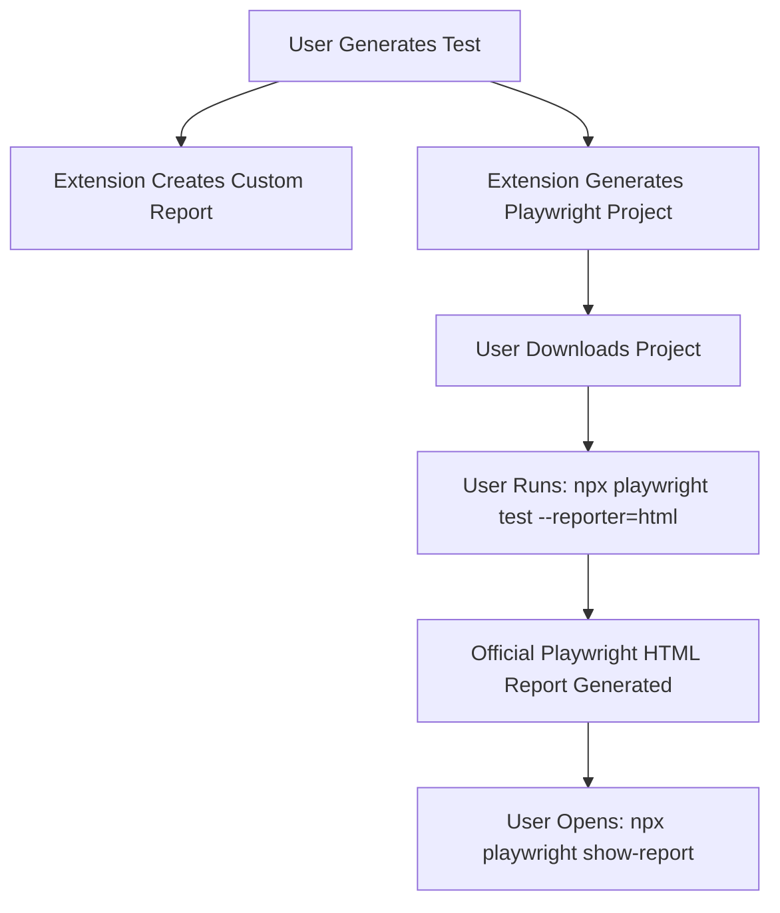

# Why We Can't Use Original Playwright HTML Reports (And How To Get Them)

## The Problem

You're absolutely right to ask why we can't use the original Playwright HTML report instead of our custom one. Here's the technical explanation:

### 1. **Chrome Extension Limitations**
- **No File System Access**: Chrome extensions run in a sandboxed environment and cannot directly access the file system
- **No Node.js Runtime**: Extensions can't execute Node.js commands like `npx playwright test`
- **Security Restrictions**: Extensions are limited to web APIs and cannot spawn external processes

### 2. **Playwright HTML Reporter Requirements**
- **Real Test Execution**: The official HTML reporter requires actual Playwright test execution
- **File System Output**: Playwright writes reports to `playwright-report/` directory
- **Local Server**: The HTML report runs on a local server (usually `http://localhost:9323`)

### 3. **What We Can't Do in Extensions**
```javascript
// ❌ This won't work in a Chrome extension:
npx playwright test --reporter=html
npx playwright show-report
```

## The Solution: Playwright Project Generation

Instead of trying to run Playwright inside the extension, we generate a complete Playwright project that users can run locally to get the official HTML reports.

### What We Provide

1. **Complete Playwright Project Setup**
   - `playwright.config.ts` with HTML reporter configuration
   - Test files with generated code
   - Package.json with all necessary scripts
   - Setup instructions

2. **Two Report Options**
   - **Custom Report**: Quick preview in the extension (what we have now)
   - **Official Playwright Report**: Full-featured report after running tests locally

### How It Works



## Getting the Original Playwright HTML Report

### Step 1: Generate Test Code
1. Use the extension to generate test code
2. Click "Download Playwright Project" in the Test Runner panel

### Step 2: Setup Playwright Project
```bash
# Install Playwright
npm install --save-dev @playwright/test
npx playwright install

# Create the project structure
mkdir my-playwright-tests
cd my-playwright-tests

# Copy the generated files
# - playwright.config.ts
# - tests/example.spec.ts
# - package.json
```

### Step 3: Run Tests with HTML Reporter
```bash
# Run tests and generate HTML report
npx playwright test --reporter=html

# Open the official HTML report
npx playwright show-report
```

### Step 4: View Official Report
- Opens at `http://localhost:9323`
- Full Playwright UI with all features
- Real test execution results
- Complete debugging information

## Why This Approach is Better

### 1. **Real Test Execution**
- Tests run in actual browsers
- Real performance metrics
- Actual screenshots and videos

### 2. **Complete Debugging**
- Trace files for debugging
- Video recordings of test runs
- Screenshots on failure
- Network logs and console output

### 3. **Team Collaboration**
- Shareable HTML reports
- CI/CD integration
- Version control friendly

### 4. **Professional Features**
- Test filtering and search
- Parallel test execution
- Retry mechanisms
- Custom reporters

## Extension Features

### Custom Report (Current)
- ✅ Quick preview in extension
- ✅ Mock data and screenshots
- ✅ Immediate feedback
- ❌ Not real test execution
- ❌ Limited debugging info

### Official Playwright Report (New)
- ✅ Real test execution
- ✅ Complete debugging
- ✅ Professional UI
- ✅ Team collaboration
- ❌ Requires local setup
- ❌ Not immediate

## Implementation Details

### Generated Project Structure
```
playwright-project/
├── playwright.config.ts      # Playwright configuration
├── package.json              # Dependencies and scripts
├── tests/
│   └── example.spec.ts       # Generated test code
├── run-tests.sh             # Quick run script
└── README.md                # Setup instructions
```

### Playwright Configuration
```typescript
export default defineConfig({
  testDir: './tests',
  reporter: [
    ['html', { outputFolder: 'playwright-report' }],
    ['json', { outputFile: 'test-results.json' }]
  ],
  use: {
    trace: 'on-first-retry',
    screenshot: 'only-on-failure',
    video: 'retain-on-failure'
  }
});
```

## Conclusion

While we can't run Playwright directly in the Chrome extension, we provide the best of both worlds:

1. **Quick Preview**: Custom reports for immediate feedback
2. **Professional Reports**: Complete Playwright projects for real testing

This approach gives users the convenience of the extension while maintaining access to the full power of Playwright's official HTML reporter.
